# System Architecture Overview Base Diagram

This file provides a base diagram for the manuscript figure placeholder
`fig:system-architecture-overview`. It is intentionally simple so it can be
redrawn cleanly in draw.io / diagrams.net.

## Mermaid base

```mermaid
flowchart LR
    classDef phase fill:#f8f6f1,stroke:#6f675a,stroke-width:1.5px,color:#1f1d1a
    classDef artifact fill:#edf4ff,stroke:#4a77d4,stroke-width:1.2px,color:#163b87
    classDef output fill:#f5efe3,stroke:#b48a3c,stroke-width:1.2px,color:#5d4513

    subgraph P1["Phase 1: Offline AOI Generation"]
        direction TB
        P1A["Input 360° videos"]
        P1B["Sparse frame extraction"]
        P1C["Open-vocabulary detection"]
        P1D["Temporal AOI association"]
        P1E["AOI authoring exports"]
        P1A --> P1B --> P1C --> P1D --> P1E
    end

    subgraph A1["Phase 1 Artifacts"]
        direction TB
        A1A["AOI maps (PNG)"]
        A1B["Per-keyframe metadata (JSON)"]
        A1C["Sequence manifest"]
        A1D["Runtime RGB24 pack"]
    end

    subgraph P2["Phase 2: Unity Runtime"]
        direction TB
        P2A["Stimulus discovery and loading"]
        P2B["360° playback in Unity"]
        P2C["OpenXR / HTC eye tracking"]
        P2D["Spherical gaze mapping"]
        P2E["Exact-colour AOI lookup"]
        P2F["Fixation commit and CSV export"]
        P2A --> P2B --> P2C --> P2D --> P2E --> P2F
    end

    subgraph A2["Phase 2 Artifact"]
        direction TB
        A2A["Fixation-level CSV exports"]
    end

    subgraph P3["Phase 3: Post Hoc Analytics"]
        direction TB
        P3A["Schema validation and normalization"]
        P3B["Participant / session / stimulus summaries"]
        P3C["AOI metrics (FB, TFF, FD, TFD, FC, visits)"]
        P3D["Transitions and grouped AOI tables"]
        P3E["HTML exploration and manuscript-ready outputs"]
        P3A --> P3B --> P3C --> P3D --> P3E
    end

    subgraph A3["Phase 3 Outputs"]
        direction TB
        A3A["CSV analytics exports"]
        A3B["HTML AOI explorer"]
        A3C["Paper tables and figures"]
    end

    P1E --> A1A
    P1E --> A1B
    P1E --> A1C
    P1E --> A1D

    A1A --> P2A
    A1B --> P2A
    A1C --> P2A
    A1D --> P2A

    P2F --> A2A
    A2A --> P3A

    P3E --> A3A
    P3E --> A3B
    P3E --> A3C

    class P1,P2,P3 phase
    class A1A,A1B,A1C,A1D,A2A artifact
    class A3A,A3B,A3C output
```

## Recommended draw.io layout

Use a left-to-right composition with three large vertical columns:

1. `Phase 1: Offline AOI Generation`
2. `Phase 2: Unity Runtime`
3. `Phase 3: Post Hoc Analytics`

Within each phase:

- Keep the processing steps stacked vertically.
- Place artifact/output boxes between columns, not inside the phases.
- Label the cross-phase arrows with the exchanged artefacts:
  - `AOI maps / metadata / manifest / RGB24 pack`
  - `Fixation-level CSV exports`
  - `Analytics CSV + HTML + paper tables`

## Suggested styling for the final figure

- Use one neutral color for the three phases.
- Use a second color for data artefacts exchanged between phases.
- Use a third color for final analytical outputs.
- Prefer short labels in the figure and keep technical detail in the caption.

## Suggested manuscript caption

`Overview of the three-phase architecture. Phase 1 generates deterministic AOI assets offline, Phase 2 consumes those assets during runtime gaze-to-AOI lookup in Unity, and Phase 3 derives post hoc attention metrics and reporting artefacts from the exported fixation-level CSV logs.`
